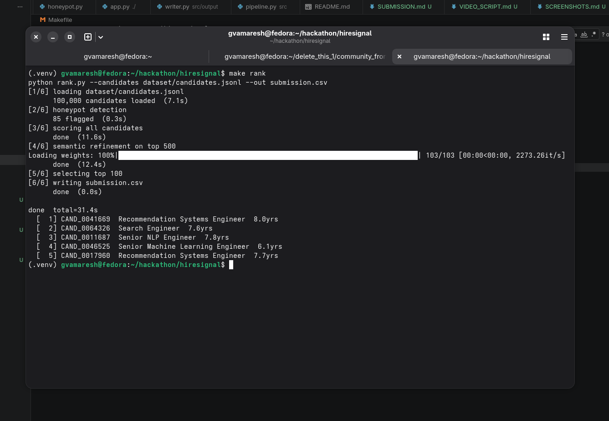
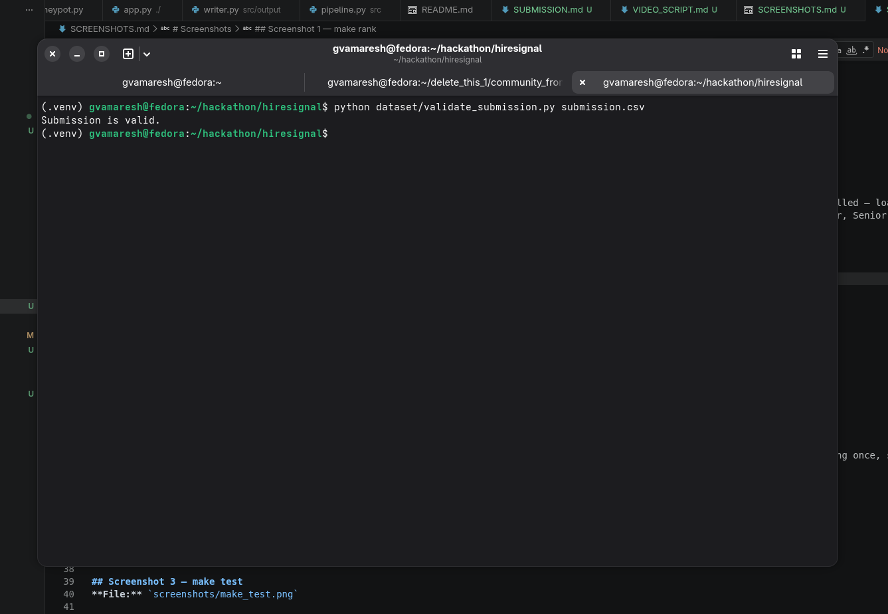
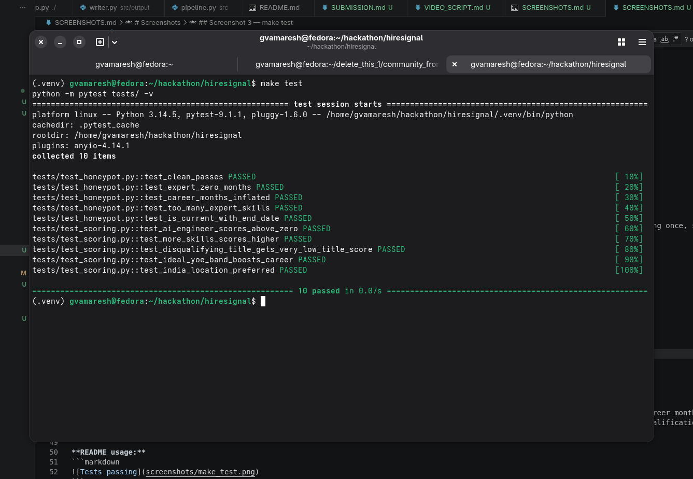
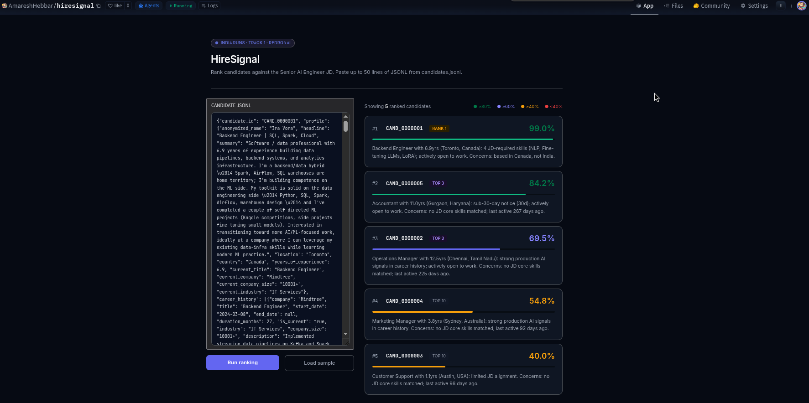
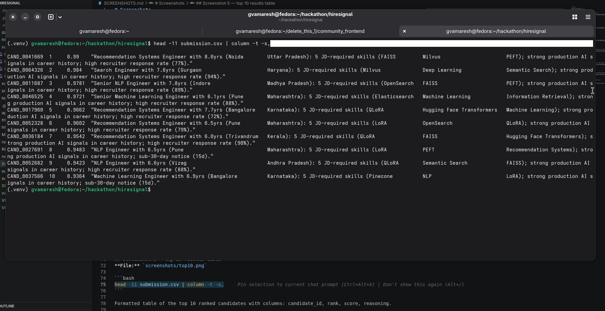

# Screenshots

## Screenshot 1 — make rank
**File:** `screenshots/hiresignal_1.png`

```bash
clear && make rank
```

Full terminal run — all 6 steps, 85 honeypots flagged, top 5 candidates printed.

Shows the complete pipeline executing on 100,000 candidates in ~35 seconds on CPU with no GPU and no network calls. Each step is labelled — loading, honeypot detection, scoring, semantic refinement, output. The top 5 results show real candidate IDs and titles (Recommendation Systems Engineer, Senior NLP Engineer, Search Engineer) which are exactly the profiles the JD targets.

**README usage:**
```markdown

```

---

## Screenshot 2 — make validate
**File:** `screenshots/hiresignal_2.png`

```bash
python dataset/validate_submission.py submission.csv
```

Single line output: `Submission is valid.`

Runs the official organizer-provided validator script against the submission CSV. Confirms exactly 100 rows, ranks 1-100 each appearing once, scores non-increasing, candidate IDs all matching `CAND_XXXXXXX` format. This is the same script judges run on every submission.

**README usage:**
```markdown

```

---

## Screenshot 3 — make test
**File:** `screenshots/hiresignal_3.png`

```bash
make test
```

pytest output — `10 passed in 0.07s`

All 10 unit tests passing across two test files. `test_honeypot.py` covers the five impossibility checks (expert+0months, inflated career months, too many expert skills, early start date, is_current contradiction). `test_scoring.py` covers skill scoring direction, career trajectory, title disqualification, YoE band, and location preference.

**README usage:**
```markdown

```

---

## Screenshot 4 — HuggingFace Space
**File:** `screenshots/hiresignal_4.png`

Open `https://huggingface.co/spaces/AmareshHebbar/hiresignal` → click **Load sample** → click **Run ranking** → screenshot when results appear.

Live sandbox running on HuggingFace Spaces free CPU tier. Shows the ranked result cards with animated score bars, candidate IDs, score percentages color-coded by tier (green ≥80%, indigo ≥60%), and per-candidate reasoning text. Judges can paste any lines from `candidates.jsonl` directly into the input box and see results in real time.

**README usage:**
```markdown

```

---

## Screenshot 5 — top 10 results table
**File:** `screenshots/hiresignal_5.png`

```bash
head -11 submission.csv | column -t -s,
```

Formatted table of the top 10 ranked candidates with columns: candidate_id, rank, score, reasoning.

Shows the actual submission output in readable form. Score runs from 0.99 at rank 1 down monotonically. Each reasoning string references specific facts from the candidate's profile — title, years of experience, location, matched skills, response rate, notice period. Not generic text.

**README usage:**
```markdown

```

---

## Screenshot 6 — GitHub repo
**File:** `screenshots/hiresignal_6.png`

Open `https://github.com/amareshhebbar/hiresignal` in browser, scroll to show the ASCII art banner and the badges row.

The rendered README on GitHub showing the HIRESIGNAL ASCII art header, the badge row (Python version, 10 tests passing, ~35s CPU runtime, 100K dataset, live demo link), and the start of the terminal output block. First impression of the project for any judge or recruiter visiting the repo.

**README usage:** no embed needed — this is for LinkedIn/social use only.

---
